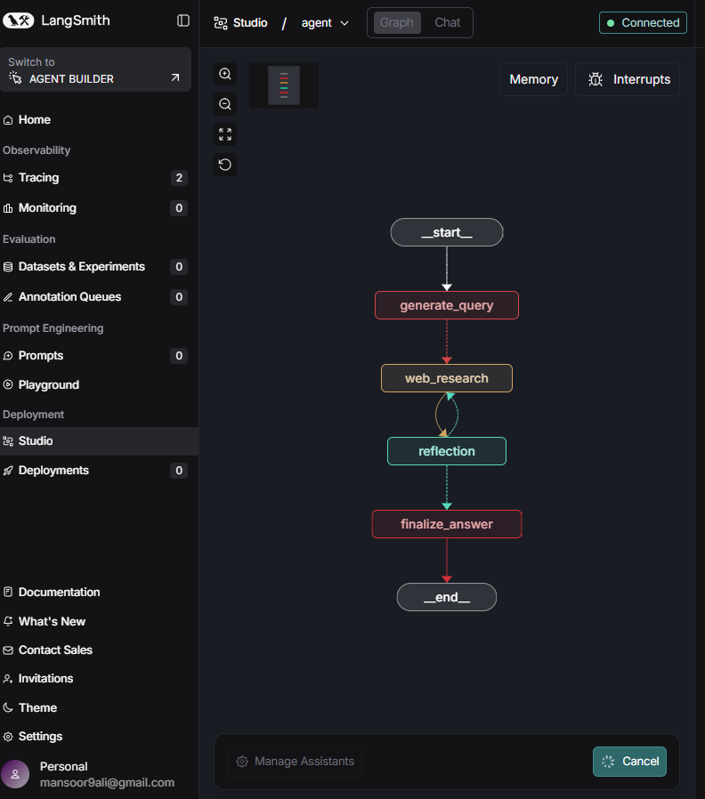

# Agent Workflow Visualization

This document describes the LangGraph workflow visualization shown in LangSmith Studio.

## Graph Structure

The Pro-Search-Server agent implements the following workflow:

  

## Node Details

### Node: __start__
- **Type**: Entry node
- **Color**: White/Gray
- **Purpose**: Initiates the graph execution

### Node: generate_query
- **Type**: Function node
- **Color**: Red
- **Purpose**: Generates 1-3 optimized search queries from user input
- **Model**: Gemini 2.0 Flash
- **Output**: List of search queries with rationale

### Node: web_research
- **Type**: Function node (Parallel)
- **Color**: Yellow/Orange
- **Purpose**: Executes web searches using Google Search API
- **Parallelization**: Each query runs independently
- **Features**: Grounding metadata, citation tracking, URL resolution

### Node: reflection
- **Type**: Function node (with self-loop)
- **Color**: Green
- **Purpose**: Evaluates research quality and identifies gaps
- **Model**: Gemini 2.5 Flash
- **Decision**: Continue research or finalize answer
- **Self-loop**: Can iterate up to max_research_loops times

### Node: finalize_answer
- **Type**: Function node
- **Color**: Red
- **Purpose**: Synthesizes research into final answer
- **Model**: Gemini 2.5 Pro
- **Output**: Well-cited, comprehensive answer with sources

### Node: __end__
- **Type**: Exit node
- **Color**: White/Gray
- **Purpose**: Terminates the graph execution

## Edge Descriptions

1. **START → generate_query**: Unconditional entry
2. **generate_query → web_research**: Conditional edge (Send) - Creates parallel branches for each query
3. **web_research → reflection**: Unconditional - Collects all parallel results
4. **reflection → web_research**: Conditional loop - If insufficient information
5. **reflection → finalize_answer**: Conditional exit - If research is complete or max loops reached
6. **finalize_answer → END**: Unconditional termination

## Visualization Notes

- **Red nodes**: Entry/exit and transformation nodes
- **Yellow/Orange nodes**: Data processing and external API calls
- **Green nodes**: Decision and evaluation nodes
- **Dotted lines**: Conditional edges
- **Solid lines**: Unconditional edges
- **Self-loop arrows**: Iterative refinement

## State Flow

The state carries the following key information:
- `messages`: User input and agent responses
- `search_query`: Generated and follow-up queries
- `web_research_result`: Search results with citations
- `sources_gathered`: Tracked URLs and references
- `research_loop_count`: Current iteration number
- `max_research_loops`: Maximum allowed iterations

## To Save the Graph PNG

In LangSmith Studio:
1. Navigate to the Graph view
2. Use the download/export button
3. Save as `static/agent_workflow.png`
4. This will replace the current `static/studio_ui.png` in the README

The graph visualization is a key feature of LangGraph Studio, enabling:
- Visual debugging
- State inspection at each node
- Time-travel debugging
- Real-time execution flow monitoring

